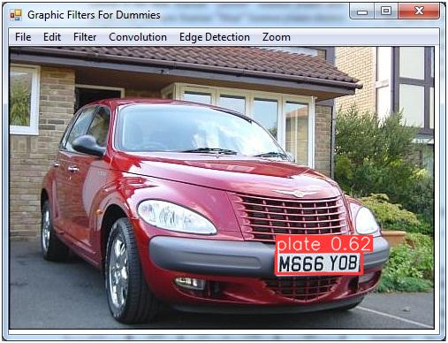
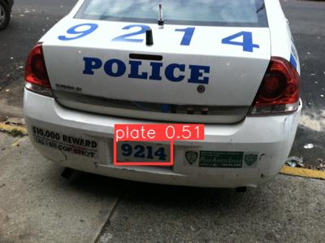
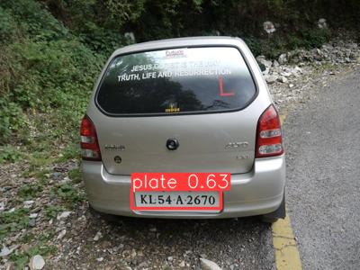
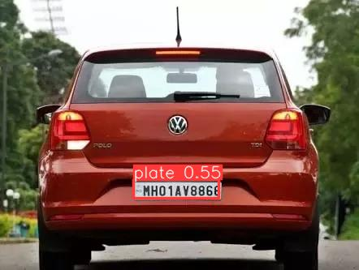

# Automatic Number Plate Recognition(ANPR)
## A streamlit based implementation of Automatic Number Plate Recognition for cars and other vehicles using images or live camera feed
--------------

## Project Overview
Automatic vehicle license plate detection and recognition is a key technique in most
traffic-related applications and is an active research topic in the image processing
domain. As a result, different methods, techniques and algorithms have been
developed for license plate detection and recognition.

### Dataset
- **Dataset Link:** [Car License Plate Detection](https://www.kaggle.com/datasets/andrewmvd/car-plate-detection)

--------------
### To Build this project
```
git clone 
```
#### create virtual enviroment use `python 3.8`
```
python -m venv <name of virtual environment>
```
or
```
conda create -n <name of virtual environment> python
```
#### use requirement.txt in to install compatible packages
```
pip install -r requirement.txt
```
```
python app.py
```
------------
## Results 
------------

| **Output Images**  | **Output Images**  |
|---------------------|-----------------------|
|   |   |
|   |   |
|   |   |

### Running the Dockerized App
1. Ensure you have Docker Installed and Setup in your OS (Windows/Mac/Linux). For detailed Instructions, please refer [this.](https://docs.docker.com/engine/install/)
2. Navigate to the folder where you have cloned this repository ( where the ***Dockerfile*** is present ).
3. Build the Docker Image (don't forget the dot!! :smile: ): 
```
docker build -f Dockerfile -t app:latest .
```
4. Run the docker:
```
docker run -p 8501:8501 app:latest
```

This will launch the dockerized app. Navigate to ***http://localhost:8501/*** in your browser to have a look at your application. You can check the status of your all available running dockers by:
```
docker ps
```
